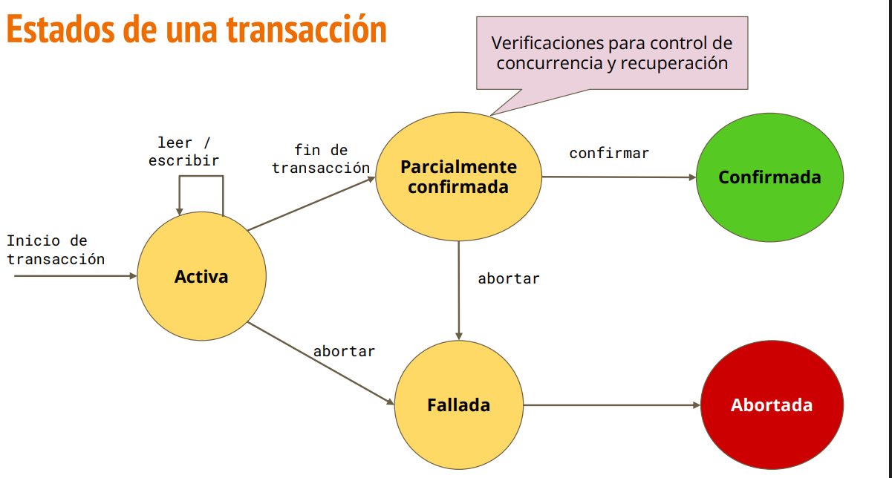

# Transacciones en Bases de Datos

Una transacción es una secuencia de instrucciones relacionadas que deben ser tratadas como una **unidad indivisible** ("todo o nada").

### Ejemplo Clásico: Transferencia Bancaria
1. Restar dinero de tu cuenta.
2. Sumar dinero en la cuenta destino.

> **Problema:** Si el sistema falla después del paso 1, el dinero se restaría de tu cuenta pero nunca llegaría a la otra. Las transacciones evitan este error.

---

## Propiedades ACID
Para que las transacciones sean seguras y confiables, deben cumplir con el acrónimo **ACID**:

1.  **Atomicidad (Atomicity):**
    * La transacción se trata como una unidad "atómica" (indivisible).
    * O se ejecutan **todas** las instrucciones o **ninguna**.
    * Si algo falla, se ejecuta un `ROLLBACK` para volver al estado inicial.
2.  **Consistencia (Consistency):**
    * Asegura que la base de datos pase de un estado válido a otro estado válido.
    * Se deben respetar todas las reglas y restricciones (ej. que el saldo nunca sea negativo).
3.  **Aislamiento (Isolation):**
    * Cada transacción es independiente. Si varias ocurren al mismo tiempo, no se interfieren.
    * *Ejemplo:* Evita que dos personas compren el último asiento de un avión simultáneamente.
4.  **Durabilidad (Durability):**
    * Una vez que se confirma la operación (`COMMIT`), los cambios son permanentes e irreversibles, incluso ante un fallo de energía o apagón.

---

## Ciclo de Vida y Estados
Las transacciones pasan por distintos estados desde que inician hasta que terminan:


* **Activa:** Estado inicial de la transacción.
* **Parcialmente comprometida:** Después de ejecutar la última instrucción.
* **Comprometida (Committed):** Tras un éxito total y guardado permanente.
* **Fallida:** Si ocurre algún error durante la ejecución.
* **Abortada:** Tras realizar el `ROLLBACK` después de una falla.

---

## Comandos Principales
* `BEGIN;` o `START TRANSACTION;`: Inicia el bloque de la transacción.
* `COMMIT;`: Guarda los cambios permanentemente.
* `ROLLBACK;`: Deshace los cambios realizados en la transacción actual.

---

## Ejemplo Práctico en SQL
```sql
-- 1. Iniciar la transacción
BEGIN;

-- 2. Restar 100 de la cuenta A
UPDATE Cuentas 
SET saldo = saldo - 100 
WHERE cuenta_id = 'A';

-- 3. Sumar 100 a la cuenta B
UPDATE Cuentas 
SET saldo = saldo + 100 
WHERE cuenta_id = 'B';

-- 4. Verificar si hubo errores. Si todo está bien, confirmar:
COMMIT;

-- 5. Si algo falló en los pasos anteriores, se usaría:
-- ROLLBACK;